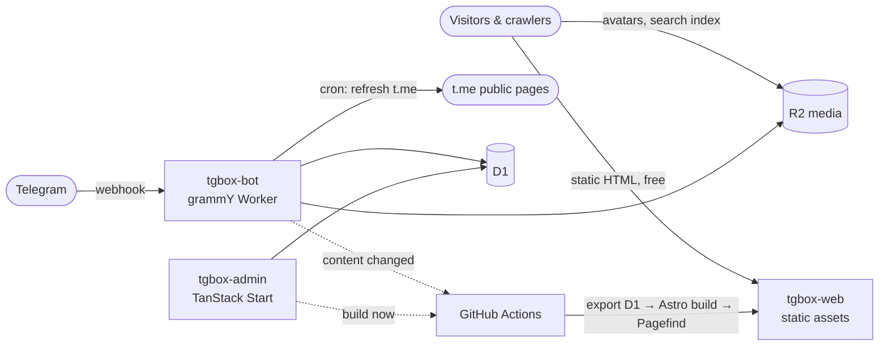

<div align="center">

<a href="https://tgbox.cc">
  
</a>

# TGbox

**An open-source Telegram channel, group & bot directory — with a submission bot, admin panel and zero-cost hosting on Cloudflare's free plan.**

[**Live demo → tgbox.cc**](https://tgbox.cc) · [Submission bot @tgboxccbot](https://t.me/tgboxccbot) · English · [简体中文](README.zh-CN.md)

[](LICENSE)
[](https://github.com/TGrpg/tgbox/actions/workflows/ci.yml)
[](https://workers.cloudflare.com)
[](https://astro.build)
[](https://www.typescriptlang.org)
[](https://grammy.dev)
[](https://github.com/TGrpg/tgbox/stargazers)


</div>

## Why TGbox

Most Telegram directories are either a static list that goes stale, or a server-rendered site that gets expensive once crawlers show up. TGbox takes a different route:

- **Every page is static.** Directory pages are pre-built HTML served as Cloudflare static assets, so visitors and search-engine crawlers never consume Worker requests.
- **Every entry stays fresh.** A cron worker re-reads public `t.me` pages, tracks member counts, recent posts and activity, and hides channels that were deleted or banned.
- **Submissions run through Telegram.** Users send a link to the bot, pick a category and tags, and admins approve with one tap. The site rebuilds itself a few minutes later.
- **It costs nothing to run.** Workers, D1, R2 and GitHub Actions all fit inside free tiers, and every write path is designed to stay far below D1's daily limit.

## Features

### Directory website
- Channels, groups and bots with categories, tags, sorting and pagination
- **Rich detail pages**: exact subscriber/member count, creation date, listing date, activity level, language, recent posts, member trend chart, related channels and groups
- Instant client-side search (Pagefind, CJK-aware) with a `Ctrl K` command palette
- Random discovery ("drift bottle"), a fastest-mirror `/go` redirect page, share links and QR codes
- Fully bilingual (Chinese / English) with `hreflang`, per-kind sitemaps, Open Graph tags and structured URLs for SEO
- Light and dark themes, mobile tab bar, PWA manifest, subtle Motion animations that respect `prefers-reduced-motion`

### Submission bot (`apps/bot`)
- Link → category → tags → confirm flow with inline keyboards
- Admin review group with approve / reject buttons, blacklist and moderation commands
- Inline search across listed entries
- Scheduled refresh with liveness detection (`not_found`, `banned`, `type_changed`) and safety guards against false positives

### Admin panel (`apps/admin`)
- Dashboard, review queue, entry management with server-side filters and bulk actions
- Manual add, categories and tags editor, blacklist, audit log, "build now" button
- Opens in the browser behind **Cloudflare Access**, or inside Telegram as a **Mini App** (signed `initData` + admin allow-list)

## Screenshots

| Channels | Detail page |
|---|---|
|  |  |

| Dark mode | Mobile |
|---|---|
|  |  |

## Architecture



| Layer | Choice |
|---|---|
| Monorepo | pnpm workspace + Turborepo, Biome, TypeScript |
| Website | Astro 7 (static output), Tailwind CSS 4, Starwind UI, coss ui islands, Motion |
| Search | Pagefind index served from R2 |
| Bot | grammY on Cloudflare Workers (webhook + cron trigger) |
| Admin | TanStack Start + Router / Query / Table, Cloudflare Access or Telegram Mini App auth |
| Data | Cloudflare D1 + Drizzle ORM, R2 for avatars, posts and member history |
| Delivery | GitHub Actions: rebuild only when D1 is marked dirty, then `wrangler deploy` |
| Tests | Vitest + `@cloudflare/vitest-pool-workers`, Playwright end-to-end |

```
apps/web            Astro static site
apps/bot            Telegram bot: webhook + scheduled refresh
apps/admin          Admin panel (web + Telegram Mini App)
packages/core       Domain operations shared by bot and admin
packages/db         Drizzle schema and D1 migrations
packages/telegram   t.me parsing, liveness detection, language detection
packages/snapshot   D1 export → site data JSON for the build
packages/shared     Categories, tags, i18n, shared schemas
scripts             Seeding, site build, Pagefind sync
```

## Quick start (local)

Requirements: Node.js ≥ 22.18 and pnpm 11. Nothing below touches your Cloudflare account or Telegram.

```bash
git clone https://github.com/TGrpg/tgbox.git
cd tgbox
pnpm install

cp apps/bot/.dev.vars.example apps/bot/.dev.vars
cp apps/admin/.dev.vars.example apps/admin/.dev.vars

node scripts/seed/seed.ts --local      # fetch sample entries into a local D1
node scripts/build-site.ts             # local D1 → snapshot → Astro build → Pagefind

pnpm --filter @tgbox/web preview       # website  → http://localhost:8787
(cd .data/media && python3 -m http.server 8790)  # local avatars and posts
pnpm --filter @tgbox/admin dev         # admin    → http://localhost:8789 (auth bypassed on localhost)
```

Checks: `pnpm check` (Biome + typecheck), `pnpm test`, `pnpm --filter @tgbox/web test:e2e`.

## Deploy your own

1. **Create resources**
   ```bash
   cd apps/bot
   pnpm exec wrangler d1 create tgbox            # put the id into apps/bot and apps/admin wrangler.jsonc
   pnpm exec wrangler d1 migrations apply tgbox --remote
   pnpm exec wrangler r2 bucket create tgbox-media
   ```
   Connect a custom domain to the R2 bucket (for example `media.example.com`).
2. **Configure** `vars` in `apps/bot/wrangler.jsonc` and `apps/admin/wrangler.jsonc` (`SITE_URL`, `R2_PUBLIC_URL`, `BOT_USERNAME`, `ADMIN_IDS`, `ADMIN_CHAT_ID`, `GITHUB_REPO`), and the `routes` domains in `apps/web` and `apps/admin`.
3. **Secrets**
   ```bash
   pnpm exec wrangler secret put BOT_TOKEN              # from @BotFather
   pnpm exec wrangler secret put WEBHOOK_SECRET         # openssl rand -hex 32
   pnpm exec wrangler secret put GITHUB_DISPATCH_TOKEN  # fine-grained PAT, Contents: read & write
   ```
4. **Deploy** the bot and admin with `pnpm exec wrangler deploy` in `apps/bot` and `apps/admin` (run `pnpm build` first for admin), then register the webhook:
   ```bash
   curl "https://api.telegram.org/bot$BOT_TOKEN/setWebhook" \
     -d url="https://<bot-worker-host>/webhook" -d secret_token="$WEBHOOK_SECRET"
   ```
5. **Site pipeline**: add repository secrets `CLOUDFLARE_API_TOKEN`, `CLOUDFLARE_ACCOUNT_ID`, `R2_ACCESS_KEY_ID`, `R2_SECRET_ACCESS_KEY` and variables `SITE_URL`, `R2_PUBLIC_URL`, `PUBLIC_BOT_USERNAME`, then run the **Build & deploy** workflow. After that the bot triggers rebuilds automatically.

### Free-plan budget

| Resource | Free limit | How TGbox stays inside it |
|---|---|---|
| Worker requests | 100k / day | Public pages are static assets and never invoke a Worker |
| Worker CPU | 10 ms / invocation | Regex-based `t.me` parsing (~2 ms), small refresh batches |
| D1 writes | 100k rows / day | Conditional upserts that write 0 rows when nothing changed, hot/cold table split, few indexes |
| Static files | 20k / version | About 9,800 entries in both languages |

## Roadmap

- [x] Static bilingual directory, detail pages, search, random discovery
- [x] Submission bot, review workflow, scheduled refresh and liveness detection
- [x] Admin panel with Cloudflare Access and Telegram Mini App login
- [ ] Self-serve promoted listings paid with Telegram Stars and USDT (Crypto Pay)
- [ ] Growth rankings, AI-translated descriptions, semantic search

## Contributing

Issues and pull requests are welcome. Please run `pnpm check` and `pnpm test` before opening a PR. Tests never call Telegram or remote Cloudflare; `t.me` pages are covered by HTML fixtures in `packages/telegram/fixtures`.

## License

[AGPL-3.0](LICENSE). You can use, modify and self-host TGbox freely; if you run a modified version as a public service, you must publish your source code under the same license. Telegram is a trademark of Telegram FZ-LLC; TGbox is an independent project and is not affiliated with Telegram.

If TGbox is useful to you, a ⭐ helps other people find it.
