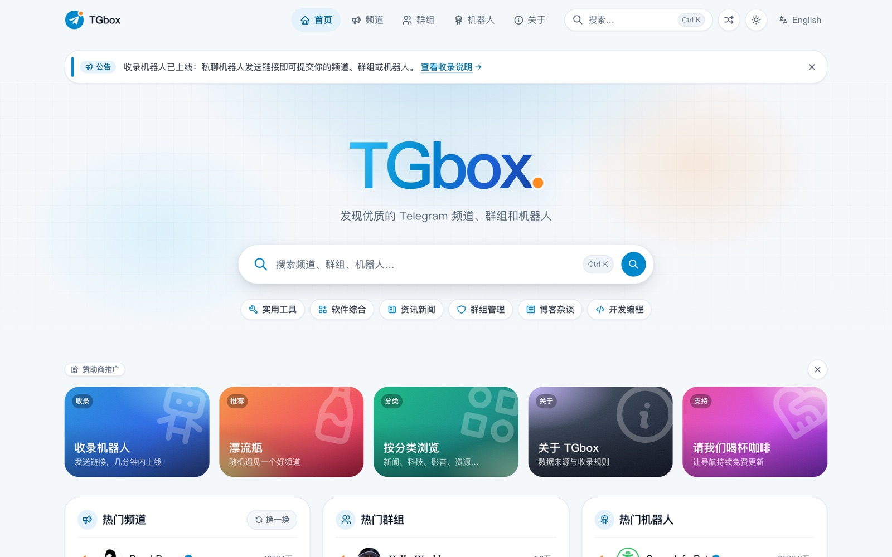
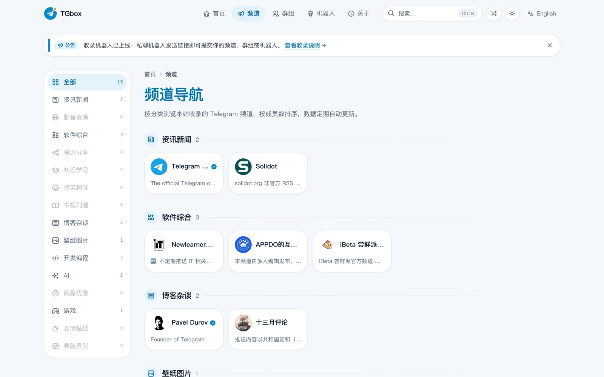
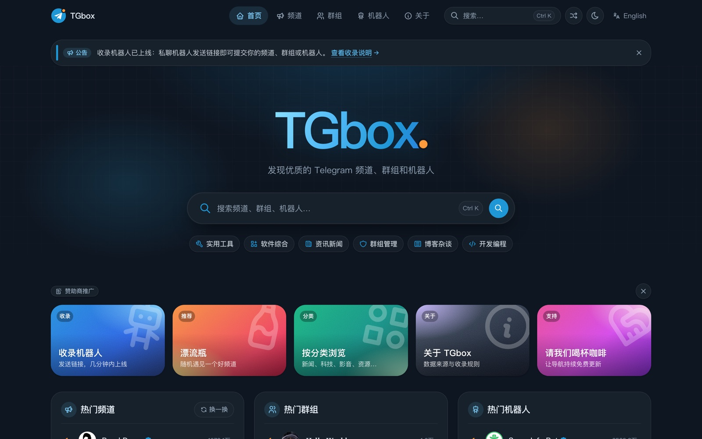
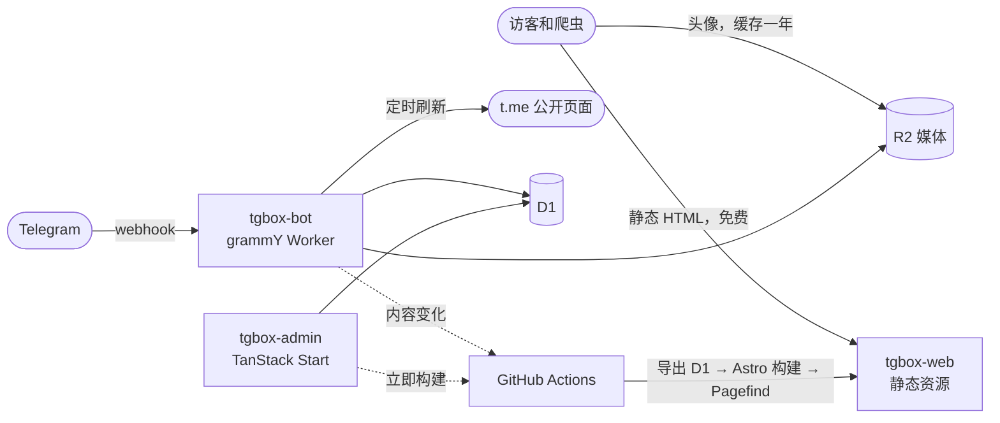

<div align="center">

<a href="https://tgbox.cc">
  
</a>

# TGbox

**开源的 Telegram 频道 / 群组 / 机器人导航站：自带收录机器人和管理后台，完全跑在 Cloudflare 免费版上。**

[**在线演示 → tgbox.cc**](https://tgbox.cc) · [收录机器人 @tgboxccbot](https://t.me/tgboxccbot) · [资源合集 awesome-telegram](https://github.com/TGrpg/awesome-telegram) · [English](README.md) · 简体中文

[](LICENSE)
[](https://github.com/TGrpg/tgbox/actions/workflows/ci.yml)
[](https://workers.cloudflare.com)
[](https://astro.build)
[](https://grammy.dev)
[](https://github.com/TGrpg/tgbox/stargazers)



</div>

## 为什么做 TGbox

常见的 TG 导航站要么是一份很快过时的静态列表，要么是服务端实时渲染，被爬虫一扫就要花钱。TGbox 的做法：

- **全部页面静态化**：频道、群组、机器人页面在构建时生成 HTML，作为 Cloudflare 静态资源发布，访客和搜索引擎爬虫都不消耗 Worker 请求额度。
- **数据自动保持新鲜**：定时任务读取公开的 `t.me` 页面，更新订阅人数、最近消息和活跃度，已注销或被封禁的频道自动下架。
- **在 Telegram 里完成收录**：用户把链接发给机器人，选分类和标签，管理员在群里一键审核，几分钟后网站自动更新。
- **零成本运行**：Workers、D1、R2、GitHub Actions 全部在免费额度内，所有写入路径都按 D1 每日限额做了优化。

## 功能

### 导航网站
- 频道、群组、机器人三大类，支持分类、标签、排序和分页
- **内容充实的详情页**：精确订阅/成员数、创建时间、收录时间、活跃度、语言、最近消息、成员趋势图、相关频道和相关群组
- Pagefind 站内搜索（支持中文），`Ctrl K` 快捷搜索
- 随机漂流瓶、`/go` 跳转页（自动选择最快的 t.me 镜像）、分享和二维码
- 简体中文、繁体中文、英文三语（繁体版在构建时由简体自动转换），带 `hreflang`、分类型站点地图、Open Graph，对 SEO 友好；浏览器偏好另一种语言的访客会看到一键切换提示，选择会被记住
- 开放数据：整个目录输出为 `/data/entries.json`，每天同步到 [awesome-telegram](https://github.com/TGrpg/awesome-telegram) 资源合集
- 页脚和 `/links/` 页的友情链接，通过机器人申请、管理员审核
- 亮色 / 暗色主题、手机底部 Tab 栏、PWA、Motion 动效（遵守 `prefers-reduced-motion`）

### 收录机器人（`apps/bot`）
- 发送链接 → 选择分类 → 选择标签 → 确认提交
- 审核群内通过 / 拒绝按钮，黑名单和管理命令
- inline 内联搜索
- 友链申请（`?start=links`），自动检测对方首页是否有回链
- 定时刷新 + 失效检测（不存在、被封禁、类型变化），带防误判保护

### 管理后台（`apps/admin`）
- 看板、审核队列、条目管理（服务端筛选、批量操作）
- 手动收录、分类和标签管理、黑名单、操作日志、立即构建
- 设置页（审核消息去向、发布频道、公告、支付方式）、推广页（订单、投放中、价格）
- 浏览器中通过 **Cloudflare Access** 登录，或在 Telegram 中作为 **Mini App** 打开（校验 `initData` 签名 + 管理员白名单）

## 截图

| 频道导航 | 详情页 |
|---|---|
|  |  |

| 暗色模式 | 手机端 |
|---|---|
|  |  |

## 架构



| 层 | 技术 |
|---|---|
| 仓库 | pnpm workspace + Turborepo、Biome、TypeScript |
| 网站 | Astro 7（静态输出）、Tailwind CSS 4、Starwind UI、coss ui、Motion |
| 搜索 | Pagefind，索引随网站一起发布 |
| 机器人 | grammY + Cloudflare Workers（webhook + Cron Trigger） |
| 后台 | TanStack Start + Router / Query / Table，Cloudflare Access 或 Telegram Mini App 登录 |
| 数据 | Cloudflare D1 + Drizzle ORM；头像、消息和成员趋势存 R2 |
| 发布 | GitHub Actions：D1 标记有变化时才构建，然后 `wrangler deploy` |
| 测试 | Vitest + `@cloudflare/vitest-pool-workers`、Playwright 端到端测试 |

## 本地运行

需要 Node.js ≥ 22.18 和 pnpm 11。以下步骤不会连接你的 Cloudflare 账号，也不会调用 Telegram。

```bash
git clone https://github.com/TGrpg/tgbox.git
cd tgbox
pnpm install

cp apps/bot/.dev.vars.example apps/bot/.dev.vars
cp apps/admin/.dev.vars.example apps/admin/.dev.vars

node scripts/seed/seed.ts --local      # 抓取示例条目写入本地 D1
node scripts/build-site.ts             # 本地 D1 → 快照 → Astro 构建 → Pagefind

pnpm --filter @tgbox/web preview       # 网站 → http://localhost:8787
(cd .data/media && python3 -m http.server 8790)  # 本地头像和消息
pnpm --filter @tgbox/admin dev         # 后台 → http://localhost:8789（本机访问免登录）
```

检查：`pnpm check`（Biome + 类型检查）、`pnpm test`、`pnpm --filter @tgbox/web test:e2e`。

## 部署自己的导航站

1. **创建资源**
   ```bash
   cd apps/bot
   pnpm exec wrangler d1 create tgbox            # 把 id 填进 apps/bot 和 apps/admin 的 wrangler.jsonc
   pnpm exec wrangler d1 migrations apply tgbox --remote
   pnpm exec wrangler r2 bucket create tgbox-media
   ```
   给 R2 桶绑定自定义域名（如 `media.example.com`）。
2. **配置** `apps/bot/wrangler.jsonc` 和 `apps/admin/wrangler.jsonc` 的 `vars`（`SITE_URL`、`R2_PUBLIC_URL`、`BOT_USERNAME`、`GITHUB_REPO`），以及 `apps/web`、`apps/admin` 里 `routes` 的域名。`ADMIN_IDS` 和 `ADMIN_CHAT_ID` 是 Telegram 的 ID，不要写进仓库，用 `wrangler secret put` 设置。
3. **写入密钥**
   ```bash
   pnpm exec wrangler secret put BOT_TOKEN              # @BotFather 给的 token
   pnpm exec wrangler secret put WEBHOOK_SECRET         # openssl rand -hex 32
   pnpm exec wrangler secret put GITHUB_DISPATCH_TOKEN  # 细粒度 PAT，Contents 读写
   pnpm exec wrangler secret put ADMIN_IDS              # 逗号分隔的 Telegram 用户 ID
   pnpm exec wrangler secret put ADMIN_CHAT_ID          # 兜底审核群 ID
   pnpm exec wrangler secret put SETTINGS_KEY           # openssl rand -hex 32，加密后台填写的第三方 token
   ```
4. **部署**：在 `apps/bot` 和 `apps/admin` 下执行 `pnpm exec wrangler deploy`（后台先 `pnpm build`），然后设置 webhook：
   ```bash
   curl "https://api.telegram.org/bot$BOT_TOKEN/setWebhook" \
     -d url="https://<机器人 Worker 域名>/webhook" -d secret_token="$WEBHOOK_SECRET"
   ```
5. **自动重新构建**：页面是预先生成的，靠 GitHub Actions 构建发布，需要两个 token。
   - **Cloudflare API token**：在 [API Tokens](https://dash.cloudflare.com/profile/api-tokens) 用 *Edit Cloudflare Workers* 模板创建，选中自己的账号和域名，并额外加上 **D1 → Edit**（构建要导出数据库）。存为仓库 Secret `CLOUDFLARE_API_TOKEN`。
   - **GitHub token**（机器人用来触发构建）：classic token 勾 `public_repo`，或 fine-grained token 只授权本仓库并把 **Contents 设为 Read and write**。用 `wrangler secret put` 存为 Worker 密钥 `GITHUB_DISPATCH_TOKEN`，并在 `apps/bot/wrangler.jsonc`、`apps/admin/wrangler.jsonc` 里填好 `GITHUB_REPO`。
   - 仓库 Secret `CLOUDFLARE_ACCOUNT_ID`，Variables `SITE_URL`、`R2_PUBLIC_URL`、`PUBLIC_BOT_USERNAME`。
   - 手动运行一次 **Build & deploy**。之后审核通过、支付成功、推广到期都会触发构建（约 3–5 分钟上线），另有每天 00:30 UTC 的定时构建（刷新排行榜）和每 6 小时一次的变更检查。
   - Pagefind 索引随网站一起发布；条目超过约 6,000 个时设 `PAGEFIND_R2=1`，改用 `scripts/sync-pagefind.ts` 放到 R2（那条路径需要 `R2_ACCESS_KEY_ID`、`R2_SECRET_ACCESS_KEY` 和 `PUBLIC_PAGEFIND_URL`），避免占用静态文件配额。

### 免费额度

| 资源 | 免费上限 | TGbox 的做法 |
|---|---|---|
| Worker 请求 | 每天 10 万 | 公开页面是静态资源，不经过 Worker |
| Worker CPU | 每次 10ms | 正则解析 `t.me`（约 2ms），小批量刷新 |
| D1 写入 | 每天 10 万行 | 条件 upsert（没变化就写 0 行）、冷热分表、尽量少的索引 |
| 静态文件 | 每版本 2 万个 | 简繁英三语约可容纳 6,500 个条目 |

## 路线图

- [x] 静态多语言导航、详情页、搜索、漂流瓶
- [x] 收录机器人、审核流程、定时刷新和失效检测
- [x] 管理后台（Cloudflare Access + Telegram Mini App 登录）
- [x] 后台设置（机器人 / 网站 / 支付）、机器人内自助购买推广位（Telegram Stars 或 USDT），到期自动下架
- [x] 涨粉排行榜页面、每日频道日报
- [x] 推广点击统计、横幅图片上传、AI 翻译简介
- [x] 指南文章、涨粉排行榜、面向搜索的结构化数据
- [ ] 语义搜索、排行榜历史归档

## 参与贡献

欢迎提交 Issue 和 PR。提 PR 前请运行 `pnpm check` 和 `pnpm test`。测试不会调用 Telegram 或远程 Cloudflare，`t.me` 页面用 `packages/telegram/fixtures` 里的 HTML 样本覆盖。

## 许可证

[AGPL-3.0](LICENSE)。可以自由使用、修改和自建；如果把修改后的版本作为公开网站或服务运行，需要以同样的许可证公开源代码。Telegram 是 Telegram FZ-LLC 的商标，TGbox 是独立项目，与 Telegram 官方无关。

觉得有用的话，点个 ⭐ 能让更多人找到它。
